# Duygu Analizi Gösterge Paneli

Bu proje, proje yönergesinde **Amazon Alexa Reviews** olarak belirtilen ve Kaggle üzerinde `bittlingmayer/amazonreviews` bağlantısıyla verilen müşteri yorumları veri setini kullanarak geliştirilmiş uçtan uca bir **duygu analizi uygulamasıdır**.

Projede müşteri yorumları **Doğal Dil İşleme (NLP)** ve **Makine Öğrenmesi** yöntemleriyle analiz edilmiştir. Tahmin sonuçları **SQL Server** veritabanına kaydedilmiş ve sonuçlar **Streamlit** tabanlı kullanıcı dostu bir gösterge paneli üzerinden görselleştirilmiştir.

Uygulama, yorumları **Positive**, **Negative** veya model güven skoru düşük olduğunda **Neutral** olarak sınıflandırır. Ayrıca model performanslarını karşılaştırır, confusion matrix sonuçlarını gösterir, yorum istatistiklerini analiz eder ve kullanıcı tarafından girilen yeni yorumları veritabanına kaydeder.

---

## İçindekiler

* [Proje Amacı](#proje-amacı)
* [Proje Özellikleri](#proje-özellikleri)
* [Sistem Tasarımı](#sistem-tasarımı)
* [Kullanılan Teknolojiler](#kullanılan-teknolojiler)
* [Veri Seti](#veri-seti)
* [Proje Klasör Yapısı](#proje-klasör-yapısı)
* [NLP Ön İşleme Süreci](#nlp-ön-i̇şleme-süreci)
* [Makine Öğrenmesi Modelleri](#makine-öğrenmesi-modelleri)
* [Model Seçim Gerekçesi](#model-seçim-gerekçesi)
* [SQL Server Veritabanı Yapısı](#sql-server-veritabanı-yapısı)
* [Kurulum Adımları](#kurulum-adımları)
* [Projeyi Çalıştırma Sırası](#projeyi-çalıştırma-sırası)
* [Dashboard Özellikleri](#dashboard-özellikleri)
* [Örnek Çıktılar](#örnek-çıktılar)
* [Görseller](#görseller)
* [Hata Yönetimi ve Sık Karşılaşılan Problemler](#hata-yönetimi-ve-sık-karşılaşılan-problemler)
* [GitHub Geliştirme Süreci](#github-geliştirme-süreci)
* [Sonuç](#sonuç)

---

## Proje Amacı

Bu projenin temel amacı, müşteri yorumlarının duygu durumunu otomatik olarak analiz eden bir sistem geliştirmektir.

Bu sistem sayesinde:

* Kullanıcı yeni bir müşteri yorumu girebilir.
* Model yorumun duygu sınıfını tahmin eder.
* Tahmin sonucu ve güven skoru gösterilir.
* Sonuç SQL Server veritabanına kaydedilir.
* Dashboard üzerinden yorum istatistikleri takip edilir.
* Eğitilen modellerin performansları karşılaştırılır.
* Confusion matrix sonuçları görselleştirilir.
* SQL Server tabloları üzerinden veri kayıtları kontrol edilebilir.

Bu proje; veri ön işleme, makine öğrenmesi, SQL veritabanı entegrasyonu, hata yönetimi ve dashboard geliştirme adımlarını bir araya getiren uçtan uca bir veri bilimi uygulamasıdır.

---

## Proje Özellikleri

Projede aşağıdaki özellikler bulunmaktadır:

* Amazon Alexa Reviews olarak belirtilen Kaggle veri setinin kullanılması
* Veri setinin pandas DataFrame formatında işlenmesi
* Hazırlanmış verilerin SQL Server tablolarına yüklenmesi
* Metin temizleme
* Küçük harfe dönüştürme
* Stopword temizleme
* Tokenization
* TF-IDF vektörleştirme
* Üç farklı makine öğrenmesi modeli eğitimi
* Model performans karşılaştırması
* Accuracy, Precision, Recall ve F1-score hesaplama
* Confusion Matrix oluşturma
* En iyi modelin kaydedilmesi
* Yeni yorum için anlık duygu tahmini
* Confidence score hesaplama
* Tahminlerin SQL Server veritabanına kaydedilmesi
* Streamlit dashboard ile görselleştirme
* Pozitif, negatif ve neutral duygu dağılımı analizi
* Günlük duygu eğilimi analizi
* Kelime frekans analizi
* Model karşılaştırma grafikleri
* GitHub üzerinde anlamlı commit geçmişi

---

## Sistem Tasarımı

Proje uçtan uca bir duygu analizi sistemi olarak tasarlanmıştır. Sistem; veri hazırlama, model eğitimi, SQL Server veritabanı entegrasyonu ve Streamlit dashboard katmanlarından oluşmaktadır.

Sistemin genel akışı aşağıdaki gibidir:

```text
Kaggle Veri Seti
        ↓
Veri Ön İşleme
        ↓
Metin Temizleme, Tokenization, Stopword Temizleme
        ↓
TF-IDF Özellik Çıkarımı
        ↓
Model Eğitimi ve Model Karşılaştırması
        ↓
En İyi Modelin Kaydedilmesi
        ↓
Yeni Yorum Tahmini
        ↓
SQL Server'a Kayıt
        ↓
Streamlit Dashboard ile Görselleştirme
```

Sistemde `scripts/` klasörü veri hazırlama, veritabanı yükleme ve model eğitimi işlemlerini yürütür. `app/` klasörü ise veritabanı bağlantısı, tahmin işlemleri ve dashboard arayüzünü içerir.

SQL Server tarafında model sonuçları, yorum tahminleri, hazırlanmış veri kayıtları ve confusion matrix değerleri ayrı tablolar halinde tutulur. Böylece hem model performansı hem de kullanıcı yorum tahminleri izlenebilir hale getirilmiştir.

Sistem dört ana bileşenden oluşmaktadır:

| Bileşen                | Açıklama                                                                                 |
| ---------------------- | ---------------------------------------------------------------------------------------- |
| Veri Hazırlama Katmanı | Kaggle veri setini okur, temizler, tokenize eder ve hazırlanmış veri oluşturur.          |
| Model Eğitim Katmanı   | TF-IDF özellikleriyle üç farklı makine öğrenmesi modelini eğitir ve karşılaştırır.       |
| Veritabanı Katmanı     | SQL Server üzerinde yorumları, model sonuçlarını ve confusion matrix değerlerini saklar. |
| Dashboard Katmanı      | Kullanıcıdan yorum alır, tahmin sonucu gösterir ve grafiklerle analiz sunar.             |

Bu tasarım sayesinde proje yalnızca model eğitimi yapan bir çalışma olmaktan çıkarılmış, veritabanı bağlantısı ve kullanıcı arayüzü bulunan tam işlevsel bir uygulama haline getirilmiştir.

---

## Kullanılan Teknolojiler

| Teknoloji    | Kullanım Amacı                     |
| ------------ | ---------------------------------- |
| Python 3.10  | Ana programlama dili               |
| Pandas       | Veri işleme                        |
| NumPy        | Sayısal işlemler                   |
| Scikit-learn | Makine öğrenmesi modelleri         |
| Streamlit    | Dashboard arayüzü                  |
| Plotly       | Grafik ve görselleştirme           |
| SQL Server   | Veritabanı yönetimi                |
| SQLAlchemy   | Python-SQL bağlantısı              |
| PyODBC       | SQL Server bağlantı sürücüsü       |
| Docker       | SQL Server container yönetimi      |
| SSMS         | SQL Server tablo ve sorgu kontrolü |
| Joblib       | Eğitilen modeli kaydetme           |
| Kaggle API   | Veri seti indirme                  |
| Git & GitHub | Versiyon kontrolü                  |

---

## Veri Seti

Bu projede, proje yönergesinde **Amazon Alexa Reviews** olarak belirtilen Kaggle veri seti kullanılmıştır. Yönergede verilen dataset bağlantısı aşağıdaki Kaggle veri setidir:

```text
bittlingmayer/amazonreviews
```

Projede kullanılan veri seti bu bağlantıdan indirilmiş ve `data/raw` klasörüne kaydedilmiştir. Veri setindeki yorumlar duygu analizi modeli geliştirmek için temizlenmiş, tokenize edilmiş ve TF-IDF yöntemiyle sayısal özelliklere dönüştürülmüştür.

Veri setindeki etiketler şu şekilde dönüştürülmüştür:

| Orijinal Etiket | Projedeki Karşılığı |
| --------------- | ------------------- |
| `__label__1`    | Negative            |
| `__label__2`    | Positive            |

Veri setinde doğrudan **Neutral** sınıfı bulunmamaktadır. Bu projede Neutral sınıfı, modelin tahmin güven skoru belirlenen eşik değerin altında kaldığında atanmıştır. Bu sayede modelin emin olmadığı yorumlar kullanıcıya Neutral olarak gösterilmiştir.

---

## Proje Klasör Yapısı

```text
sentiment-analysis-dashboard/
│
├── app/
│   ├── __init__.py
│   ├── dashboard.py
│   ├── database.py
│   ├── predict.py
│   └── utils.py
│
├── scripts/
│   ├── prepare_data.py
│   ├── init_db.py
│   └── train_models.py
│
├── sql/
│   └── schema.sql
│
├── screenshots/
│   ├── dashboard_confusion_matrix.png.jpg
│   ├── dashboard_dataset_summary.png.jpg
│   ├── dashboard_model_results.png.jpg
│   ├── dashboard_prediction.png.jpg
│   ├── dashboard_statistics1.png.jpg
│   ├── dashboard_statistics2.png.jpg
│   ├── dashboard_statistics3.png.jpg
│   ├── dashboard_statistics4.png.jpg
│   ├── sql_confusion_matrix.png.jpg
│   ├── sql_model_results.png.jpg
│   └── sql_reviews.png.jpg
│
├── docker-compose.yml
├── requirements.txt
├── .gitignore
└── README.md
```

---

## NLP Ön İşleme Süreci

Veri hazırlama aşamasında yorum metinleri model eğitimine uygun hale getirilmiştir.

### 1. Küçük Harfe Çevirme

Tüm yorum metinleri küçük harfe dönüştürülmüştür. Böylece aynı kelimenin farklı yazımları model tarafından ayrı kelimeler gibi değerlendirilmez.

### 2. URL Temizleme

Metin içerisindeki URL bağlantıları temizlenmiştir.

### 3. Özel Karakter Temizleme

Noktalama işaretleri, sayılar ve özel karakterler kaldırılmıştır.

### 4. Boşluk Düzenleme

Birden fazla boşluk tek boşluğa indirilmiş ve metnin başındaki/sonundaki boşluklar temizlenmiştir.

### 5. Tokenization

Temizlenmiş metin kelimelere ayrılmıştır. Bu işlem sayesinde yorum metinleri kelime bazlı analiz edilebilir hale getirilmiştir.

### 6. Stopword Temizleme

Anlam taşımayan ve sık geçen kelimeler veri setinden çıkarılmıştır.

Örnek stopword kelimeler:

```text
the, and, is, it, to, of, for, in, on
```

### 7. TF-IDF Vektörleştirme

Model eğitiminde metinlerin sayısal değerlere çevrilmesi için `TfidfVectorizer` kullanılmıştır. TF-IDF yöntemi, kelimelerin yorumlar içindeki önemini sayısal olarak temsil eder.

### 8. Hazırlanmış Veri Çıktısı

İşlenmiş veri aşağıdaki dosyaya kaydedilir:

```text
data/processed/prepared_reviews.csv
```

Ayrıca hazırlanmış veriler SQL Server üzerindeki `prepared_reviews` tablosuna yüklenir.

---

## Makine Öğrenmesi Modelleri

Projede üç farklı makine öğrenmesi modeli eğitilmiş ve karşılaştırılmıştır.

Kullanılan modeller:

1. Logistic Regression
2. Naive Bayes
3. Support Vector Machine

Model performansları aşağıdaki metriklerle ölçülmüştür:

* Accuracy
* Precision
* Recall
* F1-score
* Confusion Matrix

Eğitim sonucunda en iyi performans gösteren model kaydedilmiştir:

```text
models/best_model.joblib
```

Model karşılaştırma sonuçları ayrıca şu dosyada tutulur:

```text
models/model_comparison.csv
```

Dashboard üzerinde model sonuçları hem tablo hem grafik olarak gösterilmektedir.

---

## Model Seçim Gerekçesi

Bu projede **Logistic Regression**, **Naive Bayes** ve **Support Vector Machine** modelleri seçilmiştir. Bu algoritmalar metin sınıflandırma problemlerinde sık kullanılan, hızlı eğitilebilen ve performans karşılaştırması için uygun makine öğrenmesi yöntemleridir.

### Logistic Regression

Logistic Regression, TF-IDF ile temsil edilen metin verilerinde başarılı sonuçlar verebilen, yorumlanabilir ve güçlü bir sınıflandırma algoritmasıdır. Bu nedenle projede temel güçlü modellerden biri olarak kullanılmıştır.

### Naive Bayes

Naive Bayes, özellikle metin sınıflandırma ve duygu analizi problemlerinde sık kullanılan hızlı bir algoritmadır. Kelime frekansları ve olasılık temelli yaklaşımı nedeniyle bu projede karşılaştırma modeli olarak tercih edilmiştir.

### Support Vector Machine

Support Vector Machine, yüksek boyutlu veri setlerinde başarılı sonuçlar verebilen bir modeldir. TF-IDF ile oluşturulan metin özellikleri yüksek boyutlu olduğundan SVM bu proje için uygun bir model olarak değerlendirilmiştir.

Bu üç modelin birlikte kullanılması, farklı algoritmaların aynı veri seti üzerindeki performansını karşılaştırmayı sağlamıştır. En iyi model seçilirken özellikle **F1-score** metriği dikkate alınmıştır. Çünkü F1-score, precision ve recall değerlerini birlikte değerlendirdiği için sınıflandırma performansını daha dengeli şekilde gösterir.

---

## SQL Server Veritabanı Yapısı

Projede SQL Server veritabanı kullanılmaktadır.

Veritabanı adı:

```text
SentimentDashboardDB
```

Projede kullanılan temel tablolar:

### 1. `reviews`

Dashboard üzerinden girilen yorumların ve tahmin sonuçlarının saklandığı tablodur.

| Kolon               | Açıklama                    |
| ------------------- | --------------------------- |
| review_id           | Yorum ID                    |
| review_text         | Kullanıcının girdiği yorum  |
| actual_sentiment    | Gerçek etiket, varsa        |
| predicted_sentiment | Modelin tahmin ettiği duygu |
| confidence_score    | Tahmin güven skoru          |
| classification_time | Sınıflandırma zamanı        |

### 2. `model_results`

Eğitilen modellerin performans sonuçlarının saklandığı tablodur.

| Kolon           | Açıklama         |
| --------------- | ---------------- |
| result_id       | Sonuç ID         |
| model_name      | Model adı        |
| accuracy        | Accuracy değeri  |
| precision_score | Precision değeri |
| recall_score    | Recall değeri    |
| f1_score        | F1-score değeri  |
| created_at      | Kayıt zamanı     |

### 3. `prepared_reviews`

Hazırlanmış ve temizlenmiş eğitim verilerinin tutulduğu tablodur.

| Kolon              | Açıklama               |
| ------------------ | ---------------------- |
| prepared_review_id | Kayıt ID               |
| review_text        | Orijinal yorum         |
| cleaned_text       | Temizlenmiş yorum      |
| tokenized_text     | Tokenize edilmiş yorum |
| sentiment          | Duygu etiketi          |
| created_at         | Kayıt zamanı           |

### 4. `model_confusion_matrices`

Her model için confusion matrix değerlerinin saklandığı tablodur.

| Kolon               | Açıklama                      |
| ------------------- | ----------------------------- |
| matrix_id           | Matrix kayıt ID               |
| model_name          | Model adı                     |
| actual_sentiment    | Gerçek sınıf                  |
| predicted_sentiment | Tahmin edilen sınıf           |
| count_value         | Confusion matrix hücre değeri |
| created_at          | Kayıt zamanı                  |

---

## Kurulum Adımları

Aşağıdaki adımlar Windows ortamı için hazırlanmıştır.

### 1. Repository Klonlama

```bash
git clone https://github.com/ilginbor/sentiment-analysis-dashboard.git
cd sentiment-analysis-dashboard
```

### 2. Sanal Ortam Oluşturma

```bash
python -m venv .venv
```

### 3. Sanal Ortamı Aktifleştirme

PowerShell için:

```powershell
.\.venv\Scripts\Activate.ps1
```

### 4. Gerekli Paketleri Yükleme

```bash
pip install -r requirements.txt
```

### 5. SQL Server Container Başlatma

```bash
docker compose up -d
```

### 6. SQL Server Şemasını Oluşturma

SSMS üzerinden aşağıdaki dosya çalıştırılır:

```text
sql/schema.sql
```

Bu dosya gerekli veritabanı ve tabloları oluşturur.

### 7. Kaggle Veri Setini İndirme

```bash
kaggle datasets download -d bittlingmayer/amazonreviews -p data/raw --unzip
```

### 8. Veriyi Hazırlama

```bash
python scripts/prepare_data.py
```

### 9. Hazırlanan Veriyi SQL Server’a Yükleme

```bash
python scripts/init_db.py
```

### 10. Modelleri Eğitme

```bash
python scripts/train_models.py
```

### 11. Tahmin Modülünü Test Etme

```bash
python -m app.predict
```

### 12. Dashboard’u Başlatma

```bash
streamlit run app/dashboard.py
```

Dashboard aşağıdaki adreste açılır:

```text
http://localhost:8501
```

---

## Projeyi Çalıştırma Sırası

Projeyi sıfırdan çalıştırmak için önerilen sıra:

```text
1. docker compose up -d
2. sql/schema.sql dosyasını SSMS üzerinde çalıştır
3. python scripts/prepare_data.py
4. python scripts/init_db.py
5. python scripts/train_models.py
6. python -m app.predict
7. streamlit run app/dashboard.py
```

Bu sıralama takip edilmediğinde bazı dosyalar veya veritabanı tabloları eksik olabileceği için hata alınabilir.

---

## Dashboard Özellikleri

Dashboard dört ana sekmeden oluşmaktadır.

### 1. Yorum Analizi

Bu sekmede kullanıcı yeni bir müşteri yorumu girer. Model yorumu analiz eder ve tahmin sonucunu gösterir.

Gösterilen bilgiler:

* Tahmin edilen duygu
* Güven skoru
* Kullanılan model
* Örnek yorumlar

### 2. Yorum İstatistikleri

Bu sekmede veritabanına kaydedilen yorumlar üzerinden istatistiksel analiz yapılır.

Gösterilen bilgiler:

* Toplam yorum sayısı
* Pozitif yorum sayısı
* Negatif yorum sayısı
* Neutral yorum sayısı
* Ortalama güven skoru
* Duygu dağılımı grafiği
* Günlük duygu eğilimi grafiği
* En sık kullanılan kelimeler
* Son analiz edilen yorumlar

### 3. Model Sonuçları

Bu sekmede eğitilen modellerin performansları karşılaştırılır.

Gösterilen bilgiler:

* En iyi model
* En iyi F1-score
* En iyi Accuracy
* Model performans tablosu
* Model karşılaştırma grafiği
* Confusion Matrix heatmap
* Confusion Matrix tablo görünümü

### 4. Veri Seti Özeti

Bu sekmede veri seti ve proje kayıtları özetlenir.

Gösterilen bilgiler:

* Hazırlanmış eğitim verisi sayısı
* Dashboard yorum kayıtları
* Eğitilen model sayısı

---

## Örnek Çıktılar

### Veri Hazırlama Çıktısı

`prepare_data.py` çalıştırıldığında veri seti okunur, temizlenir ve hazırlanmış CSV dosyası oluşturulur.

Örnek çıktı:

```text
Dataset prepared successfully.
Rows: 49990
Output file: data/processed/prepared_reviews.csv
Columns: ['review_text', 'cleaned_text', 'tokenized_text', 'sentiment']
```

### SQL Server Veri Yükleme Çıktısı

`init_db.py` çalıştırıldığında hazırlanmış yorum verileri SQL Server üzerindeki `prepared_reviews` tablosuna yüklenir.

Örnek çıktı:

```text
prepared_reviews table is ready.
Loading 49990 rows into prepared_reviews table...
Prepared reviews loaded successfully.
```

### Model Eğitimi Çıktısı

`train_models.py` çalıştırıldığında üç farklı model eğitilir ve performans sonuçları karşılaştırılır.

Örnek çıktı:

```text
Training completed.
Best model: Logistic Regression
Best F1-score: 0.8797
Saved best model to: models/best_model.joblib
Saved results to: models/model_comparison.csv
```

### Tahmin Çıktısı

`predict.py` çalıştırıldığında örnek bir yorum sınıflandırılır ve SQL Server veritabanına kaydedilir.

Örnek çıktı:

```text
Prediction completed.
Review: This product is amazing. I really love it.
Sentiment: Positive
Confidence: 0.98
Model: Logistic Regression
```

---

## Görseller

Bu bölümde uygulamanın Streamlit dashboard ekranları ve SQL Server tablolarından alınan ekran görüntüleri bulunmaktadır.

---

### 1. Yorum Analizi Ekranı

Bu ekranda kullanıcı yeni bir müşteri yorumu girebilir. Sistem girilen yorumu analiz eder ve tahmin sonucunu gösterir.

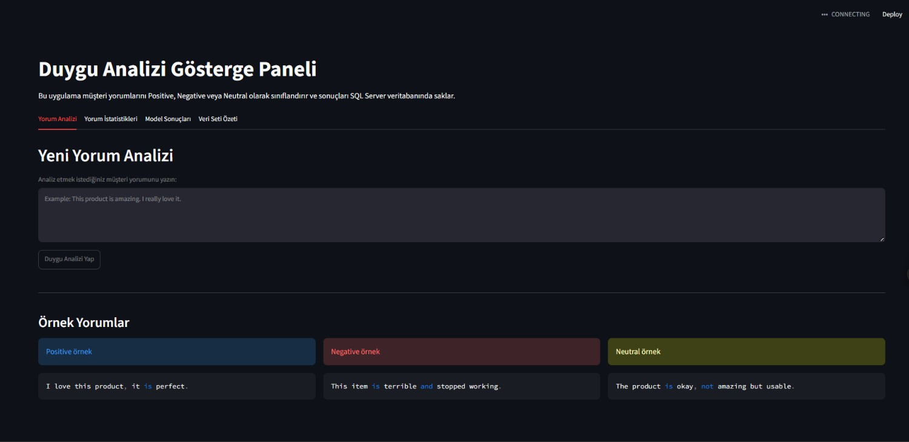

---

### 2. Yorum İstatistikleri - Genel Metrikler ve Duygu Dağılımı

Bu ekranda toplam yorum sayısı, pozitif yorum sayısı, negatif yorum sayısı, neutral yorum sayısı ve ortalama güven skoru gösterilmektedir. Ayrıca duygu dağılımı pasta grafik olarak sunulmaktadır.

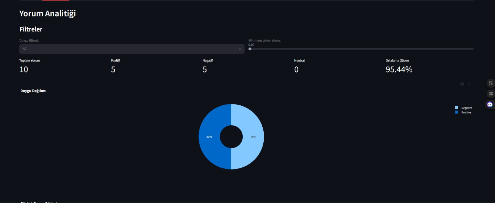

---

### 3. Günlük Duygu Eğilimi

Bu görselde analiz edilen yorumların zamana göre dağılımı gösterilmektedir. Positive ve Negative sınıflarının günlük eğilimleri grafik üzerinden incelenebilir.

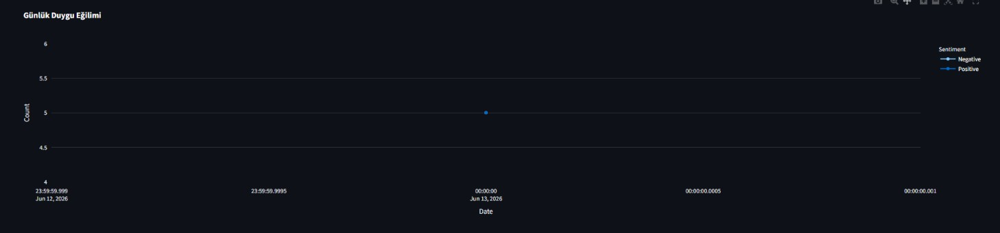

---

### 4. En Sık Kullanılan Kelimeler

Bu bölümde analiz edilen yorumlarda en sık geçen kelimeler gösterilmektedir. Kelime frekansı, yorumların genel içeriği hakkında hızlı bir fikir verir.

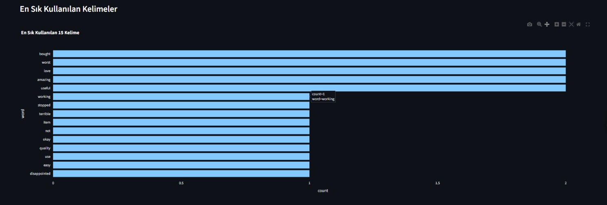

---

### 5. Son Analiz Edilen Yorumlar

Bu ekranda dashboard üzerinden analiz edilen son yorumlar tablo halinde gösterilmektedir. Tablo içinde yorum metni, tahmin edilen duygu, güven skoru ve sınıflandırma zamanı bulunmaktadır.

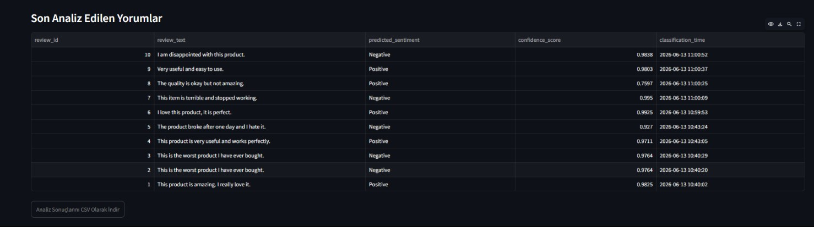

---

### 6. Model Sonuçları

Bu ekranda eğitilen modellerin performans sonuçları karşılaştırılır. Logistic Regression, Naive Bayes ve Support Vector Machine modelleri Accuracy, Precision, Recall ve F1-score metrikleriyle değerlendirilir.

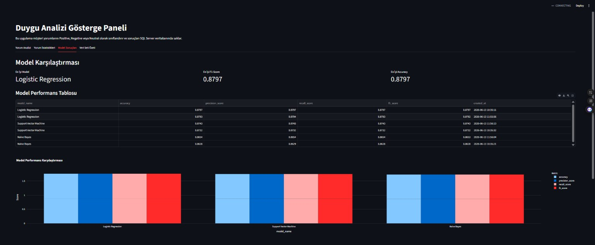

---

### 7. Confusion Matrix Heatmap

Bu ekranda seçilen modelin confusion matrix sonucu heatmap olarak gösterilir. Gerçek sınıflar ile tahmin edilen sınıflar arasındaki ilişki bu grafik üzerinden analiz edilebilir.

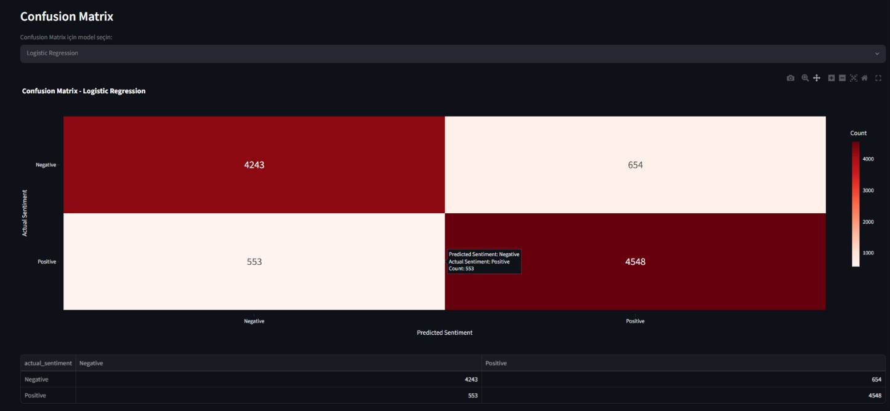

---

### 8. Veri Seti Özeti

Bu ekranda hazırlanmış eğitim verisi sayısı, dashboard yorum kayıtları ve eğitilen model sayısı gösterilir.

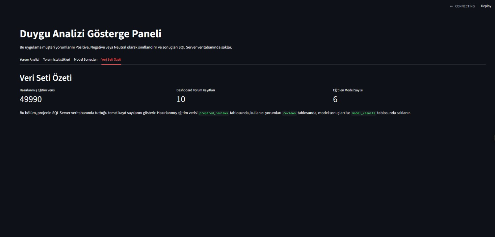

---

### 9. SQL Server - Reviews Tablosu

Bu ekran görüntüsü, dashboard üzerinden analiz edilen yorumların SQL Server veritabanındaki `reviews` tablosuna kaydedildiğini göstermektedir.

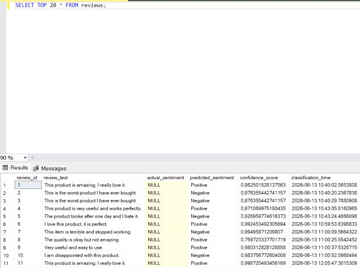

---

### 10. SQL Server - Model Results Tablosu

Bu ekran görüntüsü, model performans metriklerinin SQL Server üzerindeki `model_results` tablosuna kaydedildiğini göstermektedir.

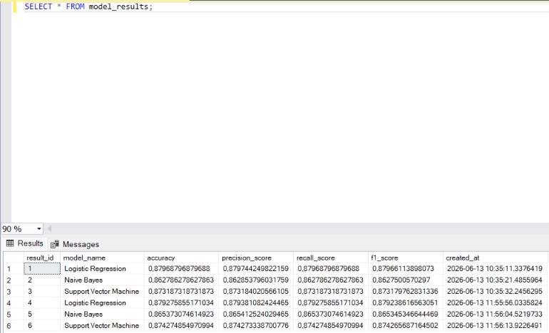

---

### 11. SQL Server - Confusion Matrix Tablosu

Bu ekran görüntüsü, her model için confusion matrix değerlerinin SQL Server üzerindeki `model_confusion_matrices` tablosunda saklandığını göstermektedir.

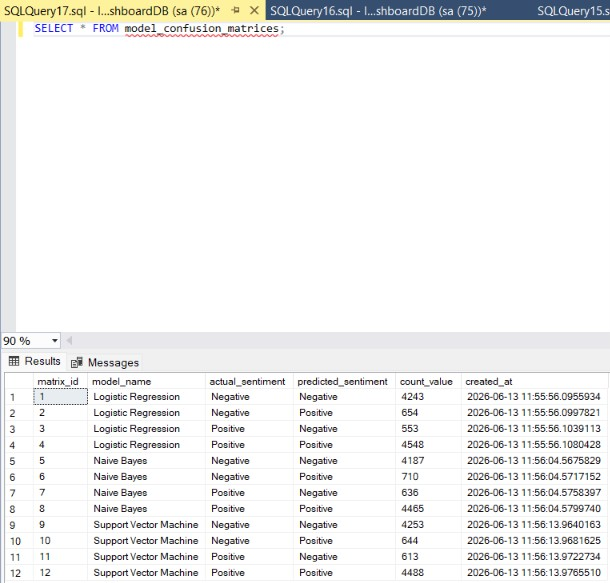

---

## Hata Yönetimi ve Sık Karşılaşılan Problemler

Bu bölüm, proje çalıştırılırken karşılaşılabilecek hataları ve çözüm yollarını açıklamaktadır.

---

### 1. `ModuleNotFoundError: No module named 'app'`

Bu hata genellikle Python dosyasının yanlış komutla çalıştırılmasından kaynaklanır.

Yanlış kullanım:

```bash
python app/predict.py
```

Doğru kullanım:

```bash
python -m app.predict
```

---

### 2. `Prepared dataset not found`

Bu hata, hazırlanmış CSV dosyası oluşturulmadan model eğitimi yapılmaya çalışıldığında oluşur.

Çözüm:

```bash
python scripts/prepare_data.py
```

---

### 3. `Best model file not found`

Bu hata, model eğitilmeden tahmin yapılmaya çalışıldığında oluşur.

Çözüm:

```bash
python scripts/train_models.py
```

---

### 4. SQL Server bağlantı hatası

Örnek hata:

```text
Login failed for user
```

veya:

```text
Cannot connect to SQL Server
```

Olası nedenler:

* Docker container çalışmıyor olabilir.
* SQL Server henüz başlamamış olabilir.
* `.env` dosyasındaki bağlantı bilgileri yanlış olabilir.
* ODBC Driver eksik olabilir.

Kontrol komutu:

```bash
docker ps
```

Container çalışmıyorsa:

```bash
docker compose up -d
```

---

### 5. ODBC Driver hatası

Örnek hata:

```text
Data source name not found
```

Bu hata, SQL Server ODBC Driver kurulu olmadığında oluşabilir.

Çözüm:

* Windows için ODBC Driver for SQL Server kurulmalıdır.
* `.env` dosyasındaki driver adı sistemde kurulu olan driver ile aynı olmalıdır.

Örnek driver adı:

```text
ODBC Driver 18 for SQL Server
```

---

### 6. Kaggle API hatası

Örnek hata:

```text
kaggle: command not found
```

Çözüm:

```bash
pip install kaggle
```

Kaggle API token dosyası doğru klasöre konmalıdır:

```text
C:\Users\KULLANICI_ADI\.kaggle\kaggle.json
```

---

### 7. PowerShell sanal ortam hatası

Örnek hata:

```text
running scripts is disabled on this system
```

Çözüm:

```powershell
Set-ExecutionPolicy -Scope Process -ExecutionPolicy Bypass
```

Sonra sanal ortam tekrar aktifleştirilir:

```powershell
.\.venv\Scripts\Activate.ps1
```

---

### 8. Dashboard açılıyor ama veri görünmüyor

Olası nedenler:

* `reviews` tablosu boş olabilir.
* `model_results` tablosu boş olabilir.
* `prepared_reviews` tablosuna veri yüklenmemiş olabilir.
* Model eğitimi yapılmamış olabilir.

Çözüm sırası:

```bash
python scripts/init_db.py
python scripts/train_models.py
python -m app.predict
streamlit run app/dashboard.py
```

---

### 9. Confusion Matrix görünmüyor

Bu hata genellikle `model_confusion_matrices` tablosunda veri olmadığında oluşur.

Çözüm:

```bash
python scripts/train_models.py
```

SSMS üzerinde kontrol:

```sql
SELECT * FROM model_confusion_matrices;
```

---

### 10. GitHub’da görseller görünmüyor

Olası nedenler:

* Görseller `screenshots` klasörüne eklenmemiş olabilir.
* Dosya adları README içindeki adlarla aynı olmayabilir.
* Görseller commit edilmemiş olabilir.

Kontrol:

```bash
git status
```

Görselleri GitHub’a göndermek için:

```bash
git add README.md screenshots/
git commit -m "Update README with Turkish documentation and project screenshots"
git push
```

---

## GitHub Geliştirme Süreci

Proje GitHub üzerinde anlamlı commit mesajları ile yönetilmiştir. Geliştirme süreci aşağıdaki commit aşamalarına ayrılmıştır:

```text
Initialize project structure and dependencies
Add SQL Server Docker setup and database schema
Add data preparation and tokenization pipeline
Add prepared reviews database loader
Add model training evaluation and confusion matrix logging
Add sentiment prediction and SQL logging module
Add Streamlit dashboard with analytics and model comparison
Add project documentation and setup instructions
Update README with Turkish documentation and project screenshots
Add system design and model selection rationale to README
```

Bu commit yapısı, projenin geliştirme adımlarının izlenebilir olmasını sağlar.

---

## Sonuç

Bu proje kapsamında müşteri yorumlarını analiz eden uçtan uca bir duygu analizi sistemi geliştirilmiştir.

Proje ile aşağıdaki kazanımlar elde edilmiştir:

* Yönergede belirtilen Kaggle veri seti kullanıldı.
* Amazon Alexa Reviews olarak belirtilen müşteri yorumları veri seti işlendi.
* NLP ön işleme adımları uygulandı.
* Logistic Regression, Naive Bayes ve Support Vector Machine modelleri eğitildi.
* Model performansları karşılaştırıldı.
* Confusion Matrix sonuçları hesaplandı.
* En iyi model kaydedildi.
* Yeni yorumlar gerçek zamanlı olarak sınıflandırıldı.
* Tahmin sonuçları SQL Server veritabanına kaydedildi.
* Streamlit dashboard ile sonuçlar görselleştirildi.
* GitHub üzerinde anlamlı commit geçmişi oluşturuldu.

Bu proje, NLP, makine öğrenmesi, SQL Server, Docker ve dashboard geliştirme süreçlerini birleştiren kapsamlı bir veri bilimi uygulamasıdır.

---

## Geliştirici

**Ilgın Bor**


